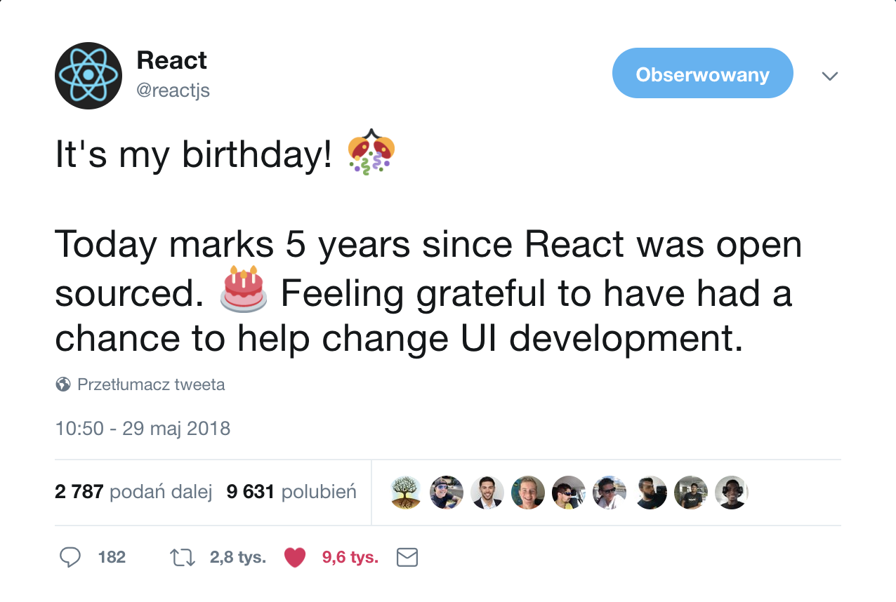
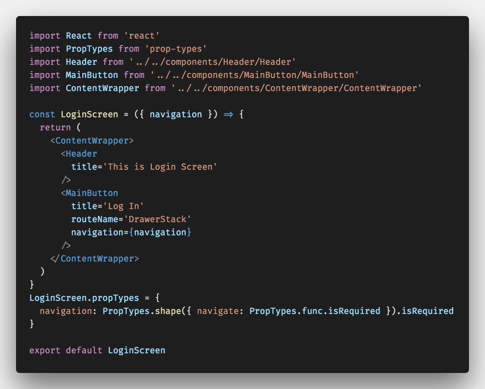
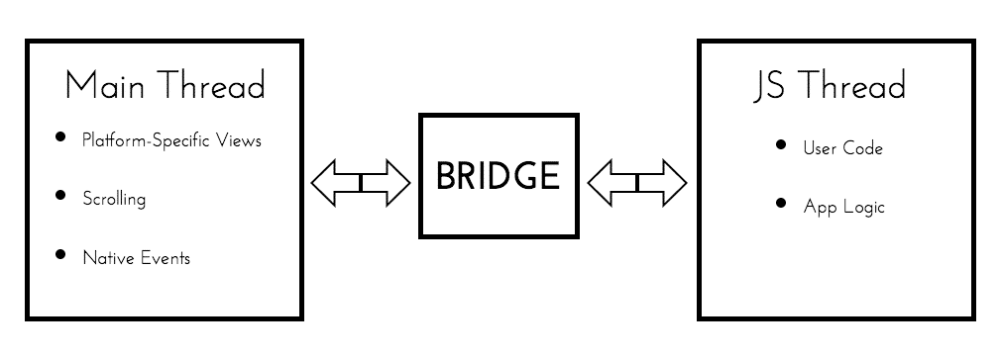

# **React**

By the end of May, React had it's 5th birthday, so it's a good time to write a post about introduction to React and React Native world.

React was created by** Jordan Walke**, a software engineer at Facebook’s newsfeed in 2011 and open-sourced at JSConf US in May 2013.

React is a JavaScript library for building user interfaces in a **declarative**, **component-based way** using a specific type of [XML](https://www.w3schools.com/xml/)-like syntax which is called JSX - mix of HTML and JavaScript. What does actually declarative and component-based mean?

**Declarative:**

- easy to create interactive UI’s
- Simple views for each state of the application
- More predictable and easier to debug code
- React efficiently update and render just the right components when the data changes

**Component-Based:**

- build simple components that manage their own state,
- Compose them to make complex UI’s
- Easly pass rich data trough app and keep state out of the DOM

# React Native

Was announced at Facebook's React.js Conf in February 2015 and open-sourced in March 2015 **enables writing native Android and iOS applications** with **JavaScript** and **React**. It has the same way of building applications, but uses different components.

With **React Native**, you can build a real mobile app - you don’t build a “mobile web app”, “HTML5 app” , or a “hybrid app”. This app is in **indistinguishable** from an app build with **Swift**, **Objective**-C or **Java**. React Native uses the same fundamental UI building blocks as regular iOS and Android apps meaning that:

- If we are building an iOS app, React Native will make sure that the Text results with a native iOS UIView containing the text.
- If we are building an Android application, it will result with a native TextView.

**Special advantage for Native Developers:**

> _React Native combines smoothly with components written in Objective-C, Java, or Swift. It's simple to drop down to native code if you need to optimize a few aspects of your application. It's also easy to build part of your app in React Native, and part of >your app using native code directly._

React Native lets you build your app faster. Instead of recompiling, you can reload your app instantly thanks to **Hot Reloading.**

The idea behind **hot reloading** is to keep the app running and to inject new versions of the files that you edited at runtime and while writing code you can even run new code while retaining your application state.

**How exactly does React Native work under the hood ?**

There are two important threads running in each React Native application. One of them is the **Main Thread**, which also runs in each standard native app. It handles displaying the elements of the user interface and processes user gestures. The other one is specific to React Native. Its task is to execute the JavaScript code in a separate JavaScript engine - **JS Thread**.

The JavaScript deals with the business logic of the application. It also defines the structure and the functionalities of the user interface. These two threads never communicate directly and never block each other.
How do threads interact? Between these two threads is the so-called **bridge**, which is the core of React Native.

## **The bridge has three important characteristics:**

- **Asynchronous** - It enables asynchronous communication between the threads. This ensures that they never block each other.
- **Batched** - It transfers messages from one thread to the other in an optimised way.
- **Serializable** - The two threads never share or operate with the same data. Instead, they exchange serialized messages.

# Business Perspective for React Native

React Native is becoming more and more popular. From the business perspective, the reason is obvious - why I should hire **2 teams** of developers for building the same application twice, for **Android** and **iOS**, when I can hire **1 team** that will do both in **the same time**?

Taking into account that the most of the new ideas for apps are [**CRUD**](https://www.codecademy.com/articles/what-is-crud)’s (Create, Read, Update, Delete) that connects with the [**API**](https://medium.freecodecamp.org/what-is-an-api-in-english-please-b880a3214a82)
which React Native is perfect for, there’s no other way to go. What’s best way to build [**MVP**](https://en.wikipedia.org/wiki/Minimum_viable_produc) ? It should be done as quick and as cost-effective as possible, because as a business owner you want to test your idea before spending all the investors money for it.

# Summary

Whether you're an Investor, Software House owner, you dream about creating a start-up or a developer interested in trying new area of programming, here's a list of things which will help you decide why you shouldn't ignore React Native:

- It's easy to learn - only 1 language (**JavaScript**) for writing native mobile apps on both platforms - iOS and Android,
- Big and constantly growing community - lot's of third party libraries
- Business-wise and business-efficient - writing application using only 1 team of developers instead of two.
- It's only version** 0.56** and lot's of products are already built with it
- Most of the new app Idea's are [**CRUD**](https://www.codecademy.com/articles/what-is-crud)'s, which React Native is perfect for
- React Native is a first cross-platform technology by means of which you can create a native mobile TV and Desktop apps
