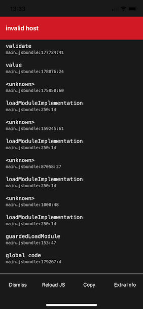

Working with React Native for the past two years taught me about solving specific problems that often occur when working with this library. I've prepared a list of few ways to solve these problems.

### **1. Error message reading & googling accordingly**

The more experience I had I learned to search through massive error logs and read the most significant part of errors which help significantly while trying to debug them. Error messages sometimes give us a straight answer to what's the exact issue.

___

### **2. Reading documentation thoroughly - this one I can't stress enough.**

This is a very cliche part of debugging, but who hasn't started using a some kind of library before reading the whole documentation ? This is programmers little sin, that's why if you're ever using some kind of library with which you have some kind of issue - be sure to firstly check the documentation thoroughly and many times the answer we're looking for is inside the docs.

___

### **3. Going Through Github issues and Upvoted comments (Invalid host & sentry)**

This one is particularly useful while working with React Native which is a very fast changing technology and sometimes the core team working on it has to introduce some breaking changes and in order to use some of the 3rd party libraries with the newest release of RN we have to make some changes and maintainers of those 3rd party libraries often don't keep up with the pace of development of this technology.

After upgrading my project to RN v.0.60 I had problems with setting up the Sentry package and there wasn't any information about how to set up it correctly with the new automatic linking flow. Github issues section to the rescue! There was a fix written by one of the maintainers inside one of the issue threads and it helped me finish the Sentry setup inside my app.

This error is my gone weekend of debugging. Out of a sudden I was getting this kind of error and couldn't launch my app in development mode and of course also couldn't build any `.ipa` file and when I did it crashed immediately

I spent tons of hours of trying to figure out what was the problem and google didn't help me apart from this issue which is a [first link](https://github.com/facebook/react-native/issues/17007](https://github.com/facebook/react-native/issues/17007)) in the google search results when you search for (Invalid Host React Native).

The answer was that I was importing a Reactotron inside a release mode of an app and Reactotron is bundled with metro bundler and a release mode don't run a metro bundler, that's why after I removed Reactotron configs and added (DEV) flag I could build the app in release mode! But the invalid host problem was still visible in the development environment,.

After a few more hours of searching through device logs, unproductive googling I finally got an idea and found out that I had Enabled Network Traffic Filtering inside my ESET Endpoint Security program. After I disabled the network traffic filtering - I suddenly could run my app in the development mode again and got back to work.

___

### **4. Checking differences between npm and Github (react-native-config)**

If you have issues while installing a package - and the Github Readme don't tell you everything, check the npm Readme - there might be some additional information for you. For example I was setting up React-native-config in a new React Native v.060+ project and I had a problem while using the variables from `.env` file inside ios `info.plist` file and I spent a great amount of time googling for solution.

After a few hours of looking I found out that there's a different setup guide Github and NPM.
Exactly this part is missing inside React Native Readme on Github, which was crucial for me to understand and use the package.

___

### **Summary**

That would be it for my ideas about solving React Native issues, I think they are more versatile add not only specific to React Native so you can make use of them while writing other types of applications in every programming launguage.

P.S. I would also add another debugging technique called Rubber-ducking to this list, but I described it in another post and you can read it [here](https://selfmadedev.com/blog/2019-09/rubber-duck-debugging/).
